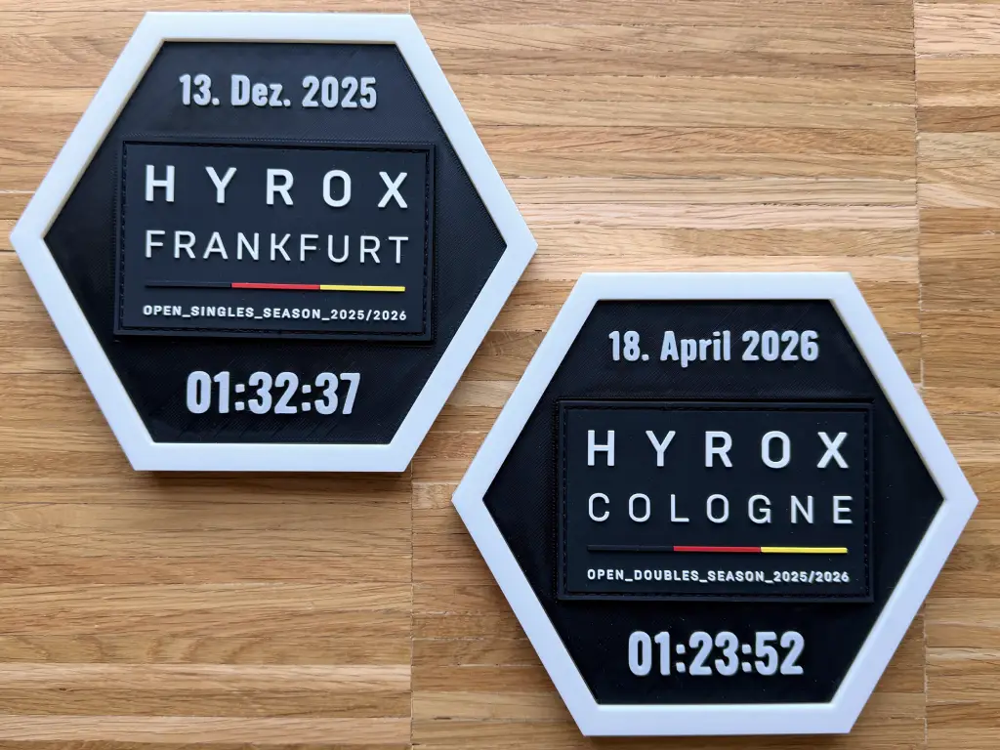

# Race patch display frame

This repository contains the OpenSCAD source files for a printable display frame for fitness race finisher patches, such as those used in the HYROX event. The default settings are sized to fit HYROX 2025/2026 patches mounted in a landscape orientation. There is a recessed pocket, as well as space above and below for your race date and finish time.

The model also supports a centered round patch pocket. Set `patch_shape` to `"circle"` and configure `patch_diameter` (70 mm by default); the existing fit clearance is applied automatically.

The model is available on [Makerworld](https://makerworld.com/en/models/2719079-race-patch-display-frame#profileId-3011850) as well and can be customized using the parametric model maker. 

## Recommended print setup

- Nozzle: 0.4 mm
- Material: PLA
- Layer height: 0.20 mm
- Walls: 2
- Infill: 15% gyroid
- Wall generator: Arachne

## Note

You can also find a [stand](exports/stl/patch_frame_stand.stl) which was not created using OpenSCAD.
